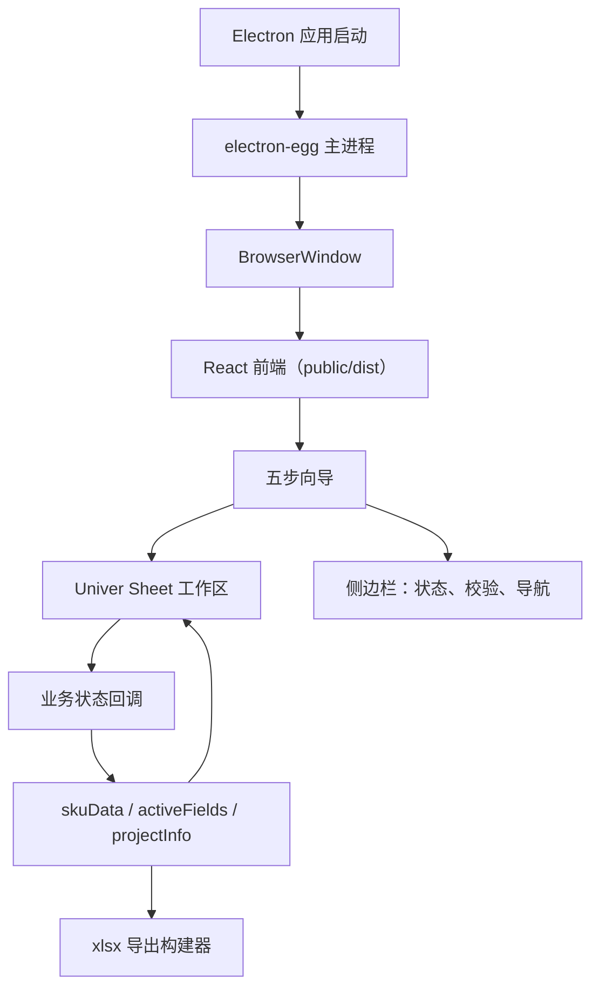
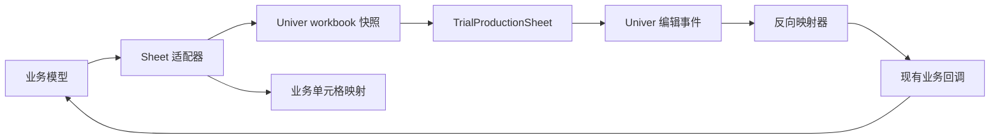

# Electron + Univer 产品设计交接文档

## 目的

本交接文档将已批准的 Electron + Univer 迁移规格转化为具体的产品设计制品，用于实现落地。它定义了桌面应用壳、电子表格工作区行为、交互状态和视觉验收标准。它不引入第二种架构或实现路径。

规范设计文档：

- `docs/superpowers/specs/2026-06-09-electron-univer-desktop-design.md`

## 产品体验概述

桌面应用仍然是一个五步试产搭配表向导。主要变化是表格工作区变为由 Univer Sheets 驱动的电子表格级编辑界面。

用户应该将此次迁移体验为：

- 一个原生桌面应用，直接打开进入现有的试产工作流。
- Step 2 到 Step 5 呈现类似电子表格的工作区。
- 更熟悉的单元格导航、复制/粘贴、调整大小和选中行为。
- 与之前相同的业务规则、校验逻辑和 Excel 导出结果。

不打算进行视觉重新设计。保留现有的企业蓝视觉语言和向导/侧边栏结构。Univer 应该感觉嵌入在当前产品内部，而不是像独立的办公套件被放置在页面中。

## 桌面壳蓝图



### 窗口

- 默认大小：类似于 `tn-viewer` 的大型桌面工作区。
- 最小尺寸：足够同时容纳向导侧边栏和 sheet 的可用空间。
- 菜单栏：默认隐藏。
- 首屏：当前应用入口画面，而不是新的启动器。
- 关闭行为：本次迁移可接受普通的桌面关闭；自定义关闭确认仅在产品流程已有需求时才需要。

### 壳区域

```text
+----------------------------------------------------------------+
| 桌面窗口                                                        |
| +------------------------------------------------------------+ |
| | 现有应用头部 / 向导上下文                                     | |
| +----------------------+-------------------------------------+ |
| | 侧边栏                | 主工作区                              | |
| | - 步骤控制            | - Step 1 的上传表单                   | |
| | - 冲突卡片            | - Step 2-5 的 Univer sheet           | |
| | - 校验卡片            | - 需要时的候选面板                     | |
| | - 导出操作            |                                      | |
| +----------------------+-------------------------------------+ |
+----------------------------------------------------------------+
```

保持当前布局层级：

- 步骤指示器仍然作为顶级的进度提示。
- 侧边栏仍然是命令/状态界面。
- 主工作区拥有大型表格/sheet 区域。

## Univer 工作区蓝图



### Sheet 结构

Sheet 应保留现有表格的心理模型：

- 行是业务字段。
- 列是 SKU/供应组合。
- 基本信息与其他分组保持视觉分离。
- 分组标题保持可见，作为分段分隔。
- Step 5 使用导出预览模型，且为只读。

Sheet 不是自由形式的电子表格。它是结构化业务数据之上的电子表格 UI。

### 所需 Sheet 状态

| 状态 | 用户所见 | 所需行为 |
|---|---|---|
| 加载中 | 现有加载覆盖层或 sheet 骨架屏 | Workbook 就绪前用户无法编辑 |
| 就绪 | Univer sheet 嵌入在工作区中 | 编辑同步到业务状态 |
| Step 2 冲突 | 受影响单元格显示红色/玫红冲突样式 | 当前冲突单元格的候选面板出现 |
| Step 4 校验错误 | 侧边栏显示错误卡片，sheet 单元格可聚焦 | 点击卡片滚动/选中映射的单元格 |
| Step 5 预览 | 只读 sheet | 布局宽高可用于导出快照 |
| 空/无 SKU | 工作区显示有用的空状态提示 | 不出现破损的 sheet 画布 |

## 交互契约

### 编辑单元格

当用户编辑单元格时：

1. Univer 发出值变更事件。
2. 反向映射器将编辑的行/列解析为 `{ skuId, supplyId, fieldId, scope }`。
3. 应用调用现有的业务回调。
4. React 状态更新。
5. Sheet 适配器根据需要重新生成 workbook 视图。

不要让 Univer 快照突变成为权威的业务状态。

### SKU 作用域字段

对于 SKU 作用域字段（如 `band`、`storage`、`project`、`stage`、`mb_id`）：

- 在可行时将其显示为视觉上跨列合并的值。
- 更新必须应用到所有相关供应，与当前行为一致。
- 校验和冲突定位仍必须解析到正确的业务键。

### 结构性操作

以下操作保持为应用级操作，而非 Univer 原生行列菜单操作：

- 在 Step 2 中添加供应。
- 在选中的 SKU 后插入 SKU。
- 复制选中的 SKU。
- 粘贴到新 SKU。
- 插入自定义字段行。
- 删除自定义字段行。

Univer 原生插入/删除菜单应被隐藏或禁用，以防止绕过 `skuData` 和 `activeFields`。

### 候选面板

Step 2 冲突候选选项从表格单元格内部移到聚焦的候选面板中。

推荐位置：

- 当冲突单元格被选中时，显示在 sheet 工作区内部的右上角。
- 如果屏幕空间紧张，使用主工作区内的右侧浮动面板。

面板内容：

- 字段标签。
- PCBA。
- 供应标签或"整列"。
- 候选按钮。
- 简短提示："选择一个候选值以解除冲突"。

候选点击行为：

- 调用与手动单元格编辑相同的更新回调。
- 在状态重新计算后移除冲突样式。
- 不直接写入 Univer 快照而不更新业务状态。

## 逐步 UX 需求

### Step 1：填写必填项

此步骤无需替换表格。

保留：

- 项目信息表单。
- 文件上传流程。
- 现有的解析/加载反馈。

桌面端特别说明：

- 本次迁移中文件选择可以继续使用浏览器文件输入。
- 除非后续明确要求，否则不需要原生 Electron 文件对话框。

### Step 2：自动获取与冲突解决

主工作区：

- Univer sheet 显示解析后的 PCBA/SKU 数据。
- 冲突单元格以可见样式标记。
- 当用户选中冲突单元格时，候选面板出现。

侧边栏：

- 冲突计数和卡片保持可见。
- 点击卡片聚焦映射的 Univer 单元格。
- 在未解决的冲突存在时，下一步仍然被阻止。

### Step 3：补充完善

主工作区：

- Univer sheet 支持电子表格式编辑。
- 现有的复制/粘贴 SKU 控制保持可用。
- 现有的插入操作保持可用。

Sheet 应使业务控制的操作显而易见。不要依赖隐藏的上下文菜单操作来完成核心工作流。

### Step 4：计算与校验

主工作区：

- Univer sheet 在当前流程允许编辑的地方保持可编辑。
- 校验目标聚焦选中并滚动到相关单元格。

侧边栏：

- 校验卡片保持当前的严重性层级。
- 点击"点击定位"通过 `TrialProductionSheet.focusCellByBusinessKey()` 路由。

### Step 5：导出预览

主工作区：

- Univer sheet 以只读模式渲染最终预览。
- 合并/跨列单元格与 `buildStep5TableModel()` 一致。
- 列宽和行高在可用时供给 `Step5LayoutSnapshot`。

导出：

- 现有的 `buildTrialProductionWorkbook()` 保持权威性。
- 导出的 `.xlsx` 应与业务预览匹配，而非 Univer 的通用导出。

## 视觉验收标准

在实现 QA 期间为以下状态截图：

- Electron 窗口加载到 Step 1。
- Step 2 sheet 至少包含一个未解决的冲突。
- Step 2 候选面板打开并聚焦在冲突单元格上。
- Step 3 sheet 显示复制/粘贴 SKU 控制。
- Step 4 校验卡片被点击，匹配的 sheet 单元格被选中。
- Step 5 只读导出预览。
- macOS `.dmg` 应用安装/打开后启动。
- Windows `.exe` 应用在 Windows/CI 验证环境中启动。

可见 UI 通过的判断标准：

- Univer 不会溢出或裁剪向导/侧边栏布局。
- Sheet 画布填满可用的工作区高度。
- 工具栏/菜单密度不会压过现有产品 UI。
- Univer UI 中出现中文标签。
- 冲突和校验聚焦状态在视觉上可区分。
- 现有应用颜色保持主导；Univer 的界面样式不应在视觉上接管应用。

## 实现交接清单

- 保持一个规范运行时：Electron 桌面。
- 保持一个规范表格：Univer 驱动的 `TrialProductionSheet`。
- 保持一个规范业务状态：React 应用状态和现有业务模块。
- 保持一个规范 Excel 导出：`buildTrialProductionWorkbook()`。
- 替换后移除未使用的旧表格代码。
- 除非明确要求，否则不添加兼容路径。
- 运行已批准设计规格中的完整测试/构建/包验证。
