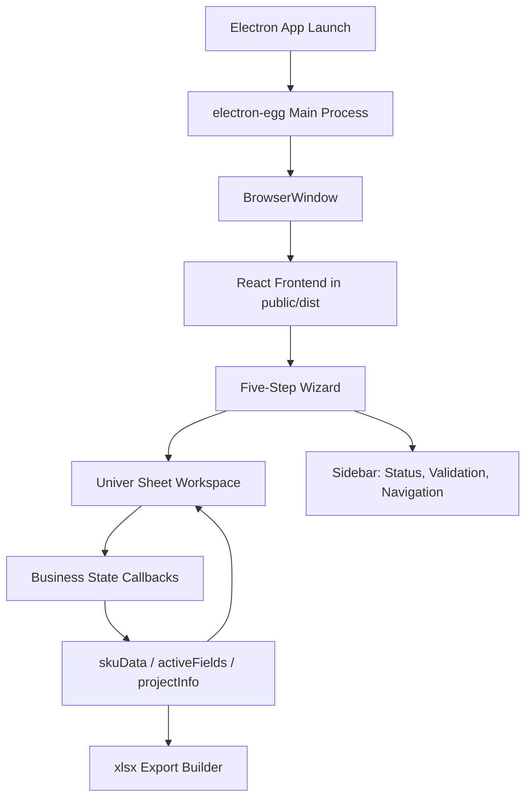
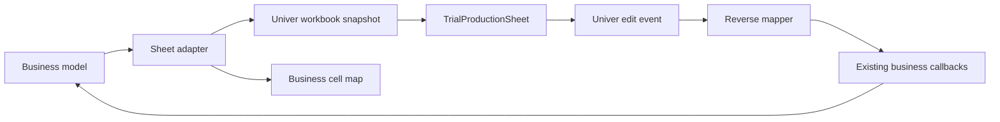

# Electron + Univer Product Design Handoff

## Purpose

This handoff turns the approved Electron + Univer migration spec into concrete product-design artifacts for implementation. It defines the desktop app shell, spreadsheet workspace behavior, interaction states, and visual acceptance criteria. It does not introduce a second architecture or implementation path.

Canonical design spec:

- `docs/superpowers/specs/2026-06-09-electron-univer-desktop-design.md`

## Product Experience Summary

The desktop app remains a five-step trial-production wizard. The major change is that the table workspace becomes a spreadsheet-grade editing surface powered by Univer Sheets.

The user should experience the migration as:

- A native desktop app that opens directly into the existing trial-production workflow.
- A spreadsheet-like workspace for Step 2 to Step 5.
- More familiar cell navigation, copy/paste, resizing, and selection behavior.
- The same business rules, validation logic, and Excel export result as before.

No visual redesign is intended. Keep the existing enterprise-blue visual language and wizard/sidebar structure. Univer should feel embedded inside the current product, not like a separate office suite dropped into the page.

## Desktop Shell Blueprint



### Window

- Default size: large desktop workspace similar to `tn-viewer`.
- Minimum size: large enough to keep the wizard sidebar and sheet usable.
- Menu bar: hidden by default.
- First screen: current app entry screen, not a new launcher.
- Close behavior: normal desktop close is acceptable for this migration; custom close confirmation is optional only if already needed by product flow.

### Shell Regions

```text
+----------------------------------------------------------------+
| Desktop Window                                                  |
| +------------------------------------------------------------+ |
| | Existing app header / wizard context                         | |
| +----------------------+-------------------------------------+ |
| | Sidebar              | Main workspace                       | |
| | - step controls      | - upload form on Step 1              | |
| | - conflict cards     | - Univer sheet on Step 2-5           | |
| | - validation cards   | - candidate panel when needed        | |
| | - export actions     |                                     | |
| +----------------------+-------------------------------------+ |
+----------------------------------------------------------------+
```

Keep the current layout hierarchy:

- Step indicator remains the top-level progress cue.
- Sidebar remains the command/status surface.
- Main workspace owns the large table/sheet region.

## Univer Workspace Blueprint



### Sheet Structure

The sheet should preserve the mental model of the existing table:

- Rows are business fields.
- Columns are SKU/supply combinations.
- Basic information stays visually separated from other groups.
- Group headers remain visible as section breaks.
- Step 5 uses the export preview model and is read-only.

The sheet is not a free-form spreadsheet. It is a spreadsheet UI over structured business data.

### Required Sheet States

| State | User sees | Required behavior |
|---|---|---|
| Loading | Existing loading overlay or sheet skeleton | User cannot edit until workbook is ready |
| Ready | Univer sheet embedded in workspace | Edits sync to business state |
| Step 2 conflict | Red/rose conflict styling on affected cells | Candidate panel appears for active conflict |
| Step 4 validation error | Error cards in sidebar, sheet cell can be focused | Clicking card scrolls/selects the mapped cell |
| Step 5 preview | Read-only sheet | Layout widths/heights can feed export snapshot |
| Empty/no SKU | Helpful empty state in workspace | No broken sheet canvas |

## Interaction Contracts

### Editing Cells

When the user edits a cell:

1. Univer emits a value-change event.
2. The reverse mapper resolves the edited row/column to `{ skuId, supplyId, fieldId, scope }`.
3. The app calls the existing business callback.
4. React state updates.
5. The sheet adapter regenerates the workbook view as needed.

Do not let Univer snapshot mutations become the authoritative business state.

### SKU-Scoped Fields

For SKU-scoped fields such as `band`, `storage`, `project`, `stage`, and `mb_id`:

- Display them as a visually spanned value when practical.
- Updates must apply to all relevant supplies, matching current behavior.
- Validation and conflict targeting must still resolve to the correct business key.

### Structural Actions

The following remain app-level actions, not native Univer row/column menu actions:

- Add supply in Step 2.
- Insert SKU after selected SKU.
- Copy selected SKU.
- Paste into new SKU.
- Insert custom field row.
- Delete custom field row.

Univer native insert/delete menus should be hidden or disabled where they would bypass `skuData` and `activeFields`.

### Candidate Panel

Step 2 conflict candidate chips move from inside table cells to a focused candidate panel.

Recommended placement:

- Inline top-right within the sheet workspace when a conflict cell is selected.
- If screen space is tight, use a right-side floating panel inside the main workspace.

Panel content:

- Field label.
- PCBA.
- Supply label or "整列".
- Candidate buttons.
- Short instruction: "选择一个候选值以解除冲突".

Candidate click behavior:

- Calls the same update callback as manual cell editing.
- Removes conflict styling after state recomputation.
- Does not write directly into Univer snapshot without updating business state.

## Step-by-Step UX Requirements

### Step 1: Fill Required Inputs

No table replacement here.

Keep:

- Project information form.
- File upload flow.
- Existing parsing/loading feedback.

Desktop-specific note:

- File selection can remain browser file input for this migration.
- Native Electron file dialogs are not required unless explicitly requested later.

### Step 2: Auto Fetch And Conflict Resolution

Main workspace:

- Univer sheet shows parsed PCBA/SKU data.
- Conflict cells are styled visibly.
- Candidate panel appears when the user selects a conflict cell.

Sidebar:

- Conflict count and cards remain visible.
- Clicking a card focuses the mapped Univer cell.
- Next step remains blocked while unresolved conflicts exist.

### Step 3: Complete Data

Main workspace:

- Univer sheet supports spreadsheet-style editing.
- Existing copy/paste SKU controls remain available.
- Existing insert actions remain available.

The sheet should make business-controlled operations obvious. Do not rely on hidden context-menu actions for core workflows.

### Step 4: Calculate And Validate

Main workspace:

- Univer sheet remains editable where the current flow allows editing.
- Validation target focus selects and scrolls to the relevant cell.

Sidebar:

- Validation cards keep current severity hierarchy.
- Clicking "点击定位" routes through `TrialProductionSheet.focusCellByBusinessKey()`.

### Step 5: Export Preview

Main workspace:

- Univer sheet renders the final preview in read-only mode.
- Merged/spanned cells match `buildStep5TableModel()`.
- Column widths and row heights feed `Step5LayoutSnapshot` where available.

Export:

- Existing `buildTrialProductionWorkbook()` remains authoritative.
- The exported `.xlsx` should match the business preview, not Univer's generic export.

## Visual Acceptance Criteria

Capture screenshots for these states during implementation QA:

- Electron window loaded on Step 1.
- Step 2 sheet with at least one unresolved conflict.
- Step 2 candidate panel open and focused on a conflict cell.
- Step 3 sheet with copy/paste SKU controls visible.
- Step 4 validation card clicked with matching sheet cell selected.
- Step 5 read-only export preview.
- macOS `.dmg` app launched after install/open.
- Windows `.exe` app launched in Windows/CI validation environment.

The visible UI passes when:

- Univer does not overflow or clip the wizard/sidebar layout.
- The sheet canvas fills the available workspace height.
- Toolbar/menu density does not overwhelm the existing product UI.
- Chinese labels appear in Univer UI.
- Conflict and validation focus states are visually distinguishable.
- Existing app colors remain dominant; Univer chrome should not visually take over the app.

## Implementation Handoff Checklist

- Keep one canonical runtime: Electron desktop.
- Keep one canonical table: Univer-backed `TrialProductionSheet`.
- Keep one canonical business state: React app state and existing business modules.
- Keep one canonical Excel export: `buildTrialProductionWorkbook()`.
- Remove unused old table code after replacement.
- Do not add compatibility paths unless explicitly requested.
- Run the full test/build/package verification from the approved design spec.
